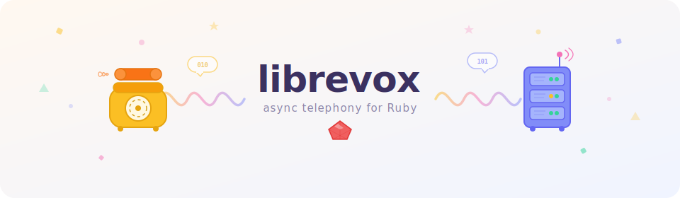

<p align="center">
  
</p>

# Librevox

A Ruby library for interacting with [FreeSWITCH](http://www.freeswitch.org) through [mod_event_socket](https://developer.signalwire.com/freeswitch/FreeSWITCH-Explained/Modules/mod_event_socket_1048924/), using async I/O.

## Table of Contents

- [Prerequisites](#prerequisites)
- [Installation](#installation)
- [Inbound Listener](#inbound-listener)
  - [Events](#events)
  - [Event Filtering](#event-filtering)
- [Outbound Listener](#outbound-listener)
  - [Dialplan](#dialplan)
  - [API Commands](#api-commands)
- [Starting Listeners](#starting-listeners)
- [Closing Connections](#closing-connections)
- [Command Socket](#command-socket)
- [Configuration](#configuration)
- [Event Socket Protocol](#event-socket-protocol)
  - [Outbound session lifecycle](#outbound-session-lifecycle)
  - [sendmsg and application execution](#sendmsg-and-application-execution)
  - [event-lock](#event-lock)
  - [Two fibers per connection](#two-fibers-per-connection)
- [API Documentation](#api-documentation)
- [License](#license)

## Prerequisites

You should be familiar with [mod_event_socket](https://developer.signalwire.com/freeswitch/FreeSWITCH-Explained/Modules/mod_event_socket_1048924/) and the differences between inbound and outbound event sockets before getting started.

Requires Ruby 3.0+.

## Installation

Add to your Gemfile:

```ruby
gem "librevox"
```

## Inbound Listener

Subclass `Librevox::Listener::Inbound` to create an inbound listener. It connects to FreeSWITCH and subscribes to events.

### Events

React to events in two ways:

1. Override `on_event`, called for every event.
2. Use `event` hooks for specific event names.

```ruby
class MyInbound < Librevox::Listener::Inbound
  def on_event(e)
    puts "Got event: #{e.content[:event_name]}"
  end

  event :channel_hangup do
    do_something
  end

  # The hook block receives a Response when it takes an argument:
  event :channel_bridge do |e|
    puts e.content[:caller_caller_id_number]
  end

  def do_something
    # ...
  end
end
```

### Event Filtering

By default, inbound listeners subscribe to all events. Use `events` to limit which events are received, and `filters` to filter by header values:

```ruby
class MyInbound < Librevox::Listener::Inbound
  events ['CHANNEL_EXECUTE', 'CUSTOM foo']
  filters 'Caller-Context' => ['default', 'example'],
          'Caller-Privacy-Hide-Name' => 'no'
end
```

## Outbound Listener

Subclass `Librevox::Listener::Outbound` to create an outbound listener. FreeSWITCH connects to it when a call hits a socket application in the dialplan.

Outbound listeners have the same event functionality as inbound, but scoped to the session.

### Dialplan

When FreeSWITCH connects, `session_initiated` is called. Build your dialplan here.

Each application call blocks until FreeSWITCH signals completion (`CHANNEL_EXECUTE_COMPLETE`), so applications execute sequentially:

```ruby
class MyOutbound < Librevox::Listener::Outbound
  def session_initiated
    answer
    digit = play_and_get_digits "enter-digit.wav", "bad-digit.wav"
    bridge "sofia/gateway/trunk/#{digit}"
  end
end
```

Applications that read input (like `play_and_get_digits` and `read`) return the collected value directly.

```ruby
def session_initiated
  answer
  set "foo", "bar"
  multiset "baz" => "1", "qux" => "2"
  playback "welcome.wav"
  hangup
end
```

For apps not yet wrapped by a named helper, call `application` directly:

```ruby
application "park"
```

Channel variables are available through `session` (a hash) and `variable`:

```ruby
def session_initiated
  answer
  number = variable(:destination_number)
  playback "greeting-#{number}.wav"
end
```

### API Commands

To avoid name clashes between applications and commands, commands are accessed through `api`:

```ruby
def session_initiated
  answer
  api.status
  api.originate 'sofia/user/coltrane', extension: "1234"
end
```

## Starting Listeners

Start a single listener:

```ruby
Librevox.start MyInbound
```

With connection options:

```ruby
Librevox.start MyInbound, host: "1.2.3.4", port: 8021, auth: "secret"
```

Start multiple listeners:

```ruby
Librevox.start do
  run MyInbound
  run MyOutbound, port: 8084
end
```

Default ports are 8021 for inbound and 8084 for outbound.

## Closing Connections

After a session ends (e.g. the caller hangs up), the outbound socket connection to FreeSWITCH remains open for post-session events. Close it manually when done to avoid lingering sessions:

```ruby
class MyOutbound < Librevox::Listener::Outbound
  event :channel_hangup do
    disconnect
  end
end
```

## Command Socket

`Librevox::CommandSocket` connects to the FreeSWITCH management console for one-off commands:

```ruby
require "librevox/command_socket"

socket = Librevox::CommandSocket.new(server: "127.0.0.1", port: 8021, auth: "ClueCon")

socket.originate 'sofia/user/coltrane', extension: "1234"
#=> #<Librevox::Protocol::Response ...>

socket.status
#=> #<Librevox::Protocol::Response ...>

socket.close
```

## Configuration

```ruby
Librevox.options[:log_file]  = "librevox.log"  # default: STDOUT
Librevox.options[:log_level] = Logger::DEBUG    # default: Logger::INFO
```

When started with `Librevox.start`, sending `SIGHUP` to the process reopens the log file, making it compatible with `logrotate(1)`.

## Event Socket Protocol

Understanding the outbound event socket protocol is important for working on
librevox internals.

### Outbound session lifecycle

When FreeSWITCH hits a `socket` application in the dialplan, it connects to the
outbound listener. The listener sends three setup commands before any
application logic runs:

```
Listener → FS:  connect
FS → Listener:  (channel data — becomes @session)

Listener → FS:  myevents
FS → Listener:  command/reply +OK

Listener → FS:  linger
FS → Listener:  command/reply +OK  → triggers session_initiated
```

### sendmsg and application execution

When an application (e.g. `answer`, `playback`, `bridge`) is executed via
`sendmsg`, FreeSWITCH always sends the `command/reply +OK` immediately — it is
an acknowledgement that the sendmsg was received, **not** that the application
finished. Application completion is signalled by a `CHANNEL_EXECUTE_COMPLETE`
event:

```
Listener → FS:  sendmsg
                call-command: execute
                execute-app-name: playback
                execute-app-arg: welcome.wav
                event-lock: true

FS → Listener:  command/reply +OK              ← immediate ack
FS → Listener:  CHANNEL_EXECUTE event          ← app started
                ...app is running...
FS → Listener:  CHANNEL_EXECUTE_COMPLETE event ← app finished
```

### event-lock

The `event-lock: true` header serializes application execution **on the
channel**. It does not change what is sent back on the socket.

Without `event-lock`, if multiple sendmsg commands are pipelined, FreeSWITCH
may dequeue and start executing the next application before the current one
finishes. With `event-lock: true`, FreeSWITCH sets an internal flag
(`CF_EVENT_LOCK`) on the channel that prevents the next queued sendmsg from
being processed until the current application completes.

### Two fibers per connection

Librevox runs two fibers for each outbound connection:

- **Session fiber** (`run_session`) — runs the setup sequence and then
  `session_initiated`. Each `send_message` or `application` call blocks the fiber
  until the reply arrives.
- **Read fiber** (`read_loop`) — reads messages from the socket and dispatches
  them to `Async::Queue` instances, waking the session fiber.

An `Async::Semaphore(1)` mutex on `send_message` ensures only one command is
in-flight at a time, so replies are always delivered to the correct caller.
This also serializes commands issued by event hooks (which run in their own
fibers) with the main session flow.

## API Documentation

Applications and commands are documented with YARD. Generate docs with:

```
yard doc
```

See `Librevox::Applications` and `Librevox::Commands` for the full API reference.

## License

MIT. See `LICENSE` for details.
